# SECTION 25 — C4 ARCHITECTURE MODEL

This section renders the architecture already specified in Sections 9, 10, 11, 12, 16, 17 and 18 as a
[C4 model](https://c4model.com): a set of nested diagrams that zoom from the system's place in the
world down to individual classes. Nothing here introduces new architecture — each diagram is a view
of decisions recorded elsewhere in this specification, with a traceability table in §25.9.

### 25.1 How to Read This Model

| Level | Diagram | Question it answers | Audience |
|---|---|---|---|
| 1 | System Context (§25.2) | Who uses the portal and what does it talk to? | Everyone, including non-technical stakeholders |
| 2 | Container (§25.3) | What are the separately deployable/runnable pieces? | Architects, developers, operations |
| 3 | Component (§25.4) | What are the major building blocks inside a container? | Developers |
| 4 | Code (§25.5) | How is a critical component structured in code? | Developers implementing that component |
| — | Dynamic (§25.6) | How do the pieces collaborate for a given scenario? | Developers, reviewers |
| — | Deployment (§25.7) | How do containers map onto infrastructure? | Operations, security |
| — | Build sequence (§25.8) | In what order does the model get built, and why? | Delivery leads, architects |

**Notation.** Diagrams are written in Mermaid and render directly in GitHub, GitLab, VS Code
(Markdown Preview Mermaid extension) and MkDocs Material. Colours follow the standard C4 palette:
blue = a container/component inside the ACSA system boundary, grey = an external or off-the-shelf
system, dark blue = a person.

**Boundary rule used throughout.** Keycloak, ClamAV, PostgreSQL, Redis and MinIO are third-party
products the ACSA team operates but does not build. They are therefore drawn as *external systems*
at Level 1 (they are not the thing being specified) and as *containers inside the deployment
boundary* at Level 2 and Level 5, because `docker-compose.yml` (§17.1) runs them alongside the ACSA
containers. This is the conventional C4 treatment and is intentional, not an inconsistency.

---

### 25.2 Level 1 — System Context

The ACSA Self-Evaluation Portal as a single box, its users (Section 4 roles, grouped by function to
keep the diagram legible), and the systems it depends on.

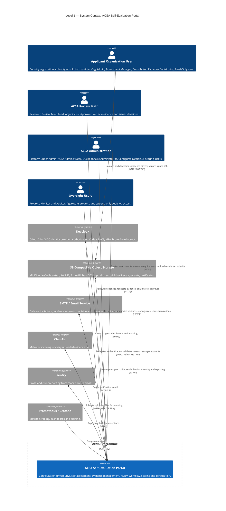

**Notes on the context.**

- Evidence bytes never transit the API. Clients `PUT` directly to object storage against a
  15-minute pre-signed URL (§16.1), which is why the applicant has a direct relationship to storage.
  This is also why NGINX caps request bodies at 10 MB while the evidence limit is 50 MB (§17.2, §16.2).
- The portal is the only writer of the compliance record. There is no upstream system feeding
  assessments in, and no downstream certification registry, unless OD-009 (public directory of
  approved assessments) is resolved in favour of a public API — that decision would add an external
  consumer to this diagram.

---

### 25.3 Level 2 — Container

Zooming into the portal. Every box is a separately runnable process, and each maps to a service in
`docker-compose.yml` (§17.1) or to a client build artefact (§9.1).

```mermaid
C4Container
    title Level 2 — Containers: ACSA Self-Evaluation Portal

    Person(applicant, "Applicant Organization User", "Answers requirements, uploads evidence")
    Person(reviewer, "ACSA Review Staff", "Reviews, adjudicates, approves")
    Person(admin, "ACSA Administration", "Configures catalogue and platform")

    System_Boundary(portal, "ACSA Self-Evaluation Portal") {
        Container(mobile, "Mobile Application", "React Native 0.7x / Expo, TypeScript", "iOS and Android build via EAS. Encrypted SQLite draft cache, secure token store, i18next EN/FR/PT.")
        Container(web, "Web Application", "React Native Web, TypeScript", "Same codebase compiled for browsers. Refresh token in HttpOnly SameSite=Strict cookie.")
        Container(proxy, "Reverse Proxy", "NGINX (alpine)", "TLS 1.2+ termination, HSTS, CSP and security headers, 10 MB body cap, upstream load-balancing across API replicas.")
        Container(api, "API Application", "FastAPI, Python 3.12, Uvicorn, SQLAlchemy 2.x async", "Versioned REST/JSON under /api/v1. Routes → services → repositories. 2+ stateless replicas.")
        Container(worker, "Background Worker", "Celery, Python 3.12", "Queues: default, virus_scan, reports, notifications. 2+ replicas.")
        Container(beat, "Scheduler", "Celery Beat", "Periodic jobs: reminders, overdue alerts, retention sweeps. Exactly one instance.")
        ContainerQueue(redis, "Broker and Cache", "Redis 7", "Celery broker/result backend, session cache, questionnaire structure cache (1 h), analytics aggregates (15 min), idempotency keys (24 h).")
        ContainerDb(db, "Application Database", "PostgreSQL 16", "Organizations, questionnaire versions, assessments, responses, evidence metadata, findings, scores, partitioned audit log. Row-Level Security by organization_id.")
        ContainerDb(kcdb, "Identity Database", "PostgreSQL 16 (acsa_keycloak)", "Keycloak realm, users, sessions. Separate database on the same instance.")
        Container(kc, "Identity Provider", "Keycloak 24", "Realm 'acsa'. Authorization Code + PKCE, TOTP MFA, progressive lockout, role claims.")
        Container(minio, "Object Storage", "MinIO / S3-compatible", "Private bucket {env}-acsa-evidence. SSE at rest, pre-signed access only, lifecycle to cold at 2 y, delete at 7 y.")
        Container(clam, "Malware Scanner", "ClamAV clamd", "Scans every uploaded object before it becomes accessible.")
        Container(prom, "Metrics", "Prometheus", "Scrapes API and worker /metrics endpoints.")
        Container(graf, "Dashboards", "Grafana", "Operational dashboards and alert routing.")
    }

    System_Ext(smtp, "SMTP / Email Service", "Outbound notification delivery")
    System_Ext(sentry, "Sentry", "Crash and error reporting")

    Rel(applicant, mobile, "Uses", "iOS / Android")
    Rel(applicant, web, "Uses", "HTTPS")
    Rel(reviewer, web, "Uses", "HTTPS")
    Rel(admin, web, "Uses", "HTTPS")

    Rel(mobile, proxy, "REST calls with Bearer token", "HTTPS/JSON")
    Rel(web, proxy, "REST calls with Bearer token", "HTTPS/JSON")
    Rel(mobile, kc, "Authorization Code + PKCE redirect", "HTTPS/OIDC")
    Rel(web, kc, "Authorization Code + PKCE redirect", "HTTPS/OIDC")
    Rel(mobile, minio, "Uploads/downloads evidence via pre-signed URL", "HTTPS")
    Rel(web, minio, "Uploads/downloads evidence via pre-signed URL", "HTTPS")

    Rel(proxy, api, "Proxies /api/ and /health/", "HTTP :8000")
    Rel(api, db, "Reads and writes", "asyncpg")
    Rel(api, redis, "Caches, enqueues tasks, stores idempotency keys", "RESP")
    Rel(api, kc, "Validates JWT signature/issuer/audience; manages accounts", "HTTPS")
    Rel(api, minio, "Generates pre-signed URLs, verifies object presence and checksum", "S3 API / aioboto3")
    Rel(api, sentry, "Reports exceptions", "HTTPS")

    Rel(worker, redis, "Consumes tasks", "RESP")
    Rel(worker, db, "Reads and writes", "asyncpg")
    Rel(worker, minio, "Downloads for scanning; writes reports and certificates", "S3 API")
    Rel(worker, clam, "Streams file for scanning", "TCP 3310")
    Rel(worker, smtp, "Sends notification email", "SMTP/TLS")
    Rel(beat, redis, "Enqueues scheduled tasks", "RESP")
    Rel(kc, kcdb, "Reads and writes", "JDBC")

    Rel(prom, api, "Scrapes /metrics", "HTTP")
    Rel(prom, worker, "Scrapes /metrics", "HTTP")
    Rel(graf, prom, "Queries", "PromQL")

    UpdateLayoutConfig($c4ShapeInRow="4", $c4BoundaryInRow="1")
```

**Container responsibilities at a glance.**

| Container | Owns | Never does |
|---|---|---|
| Mobile / Web App | Presentation, offline draft cache, optimistic concurrency headers | Score computation, permission decisions (both are advisory client-side only) |
| NGINX | TLS, security headers, request size limits, upstream balancing | Business logic, authentication decisions |
| API Application | Permission enforcement, transactions, validation, state transitions, scoring | Long-running work (> ~2 s), file byte transfer |
| Background Worker | Virus scanning, report/certificate generation, email dispatch | Serving user requests, holding request-scoped state |
| Scheduler | Emitting periodic task messages only | Any business logic; it must remain single-instance |
| PostgreSQL | System of record, RLS enforcement, immutable audit and snapshot tables | Application logic beyond constraints and RLS policies |
| Redis | Broker, cache, idempotency keys | System of record — every Redis value must be reconstructible |
| Object Storage | Evidence, generated reports, certificates | Any authorisation decision (pre-signed URL TTL is the only gate) |

---

### 25.4 Level 3 — Components

#### 25.4.1 API Application Components

The internal structure of the FastAPI container, following the layering rule from §10.2: routes hold
no business logic, services own transactions, modules do not reach into one another's tables.

```mermaid
C4Component
    title Level 3 — Components: API Application (FastAPI)

    Container_Ext(clients, "Mobile / Web Application", "React Native", "Calls /api/v1")
    ContainerDb_Ext(db, "PostgreSQL 16", "Database", "System of record")
    ContainerQueue_Ext(redis, "Redis 7", "Broker/Cache", "Tasks and cache")
    Container_Ext(kc, "Keycloak", "OIDC", "Identity provider")
    Container_Ext(store, "Object Storage", "S3 API", "Evidence and reports")

    Container_Boundary(api, "API Application") {
        Component(mw, "Middleware and Core", "app/core — middleware.py, logging.py, exceptions.py", "Trace-ID injection, structlog JSON logging, rate limiting, CORS, uniform error envelope, /metrics.")
        Component(deps, "Dependency Layer", "app/api/dependencies.py", "get_current_user, require_permission('ASM_SUBMIT'), get_assessment_or_404, pagination and idempotency dependencies.")
        Component(routes, "Route Layer", "app/api/v1/routes/* (20 modules)", "Thin HTTP adapters. Pydantic request/response models. No business logic.")

        Component(identity, "Identity and Access", "modules/identity, users, roles", "Token validation, user provisioning from Keycloak sub, role and permission resolution, invitations.")
        Component(orgs, "Organization Module", "modules/organizations", "Registration, approval, membership, organization-scoped access checks.")
        Component(qnr, "Questionnaire Module", "modules/questionnaires", "Versions, sections, requirements, response types, translations, publish/retire lifecycle (BR-QNR-001..003).")
        Component(asm, "Assessment Module", "modules/assessments — service, validation, transitions", "Creation, team and section assignment, submission validation (ASM-FR-004), status state machine (ASM-FR-003).")
        Component(resp, "Response Module", "modules/responses — service, scoring", "Autosave with optimistic concurrency (BR-RSP-002), immutable version history, completeness evaluation.")
        Component(evd, "Evidence Module", "modules/evidence — service, storage", "Pre-signed URL issuance, confirm-and-register, checksum verification, confidentiality classification, versioning.")
        Component(rev, "Review Module", "modules/reviews, evidence_requests, adjudication, approvals", "Reviewer assignment, findings, evidence requests, adjudication decisions, approval and certificate issuance.")
        Component(scoring, "Scoring Engine", "modules/scoring/engine.py", "Weight × compliance-value computation, N/A exclusion, banding, snapshot capture (BR-SCR-001..003).")
        Component(results, "Results and Reports", "modules/results, reports", "Score retrieval, report request lifecycle; generation itself is delegated to the worker.")
        Component(analytics, "Analytics Module", "modules/analytics", "Cross-organization aggregates, completion, reviewer workload. Redis-cached, read-replica-eligible.")
        Component(notif, "Notification Module", "modules/notifications", "Notification records and preferences; dispatch delegated to the worker.")
        Component(audit, "Audit Module", "modules/audit", "Append-only event writer used by every mutating service (BR-AUD-001).")
        Component(content, "Content and Settings", "modules/content, settings", "Manuals, guidance text, system settings such as max file size and thresholds.")

        Component(repo, "Persistence Layer", "app/db — base, session, Alembic", "Async session factory, transaction scope, RLS session variables, migrations.")
        Component(integr, "Integration Adapters", "app/integrations", "keycloak, object_storage (aioboto3), email, antivirus clients.")
        Component(taskq, "Task Dispatcher", "app/workers/celery_app.py", "Enqueues virus_scan, report_generation, notification_dispatch.")
    }

    Rel(clients, mw, "HTTPS/JSON via NGINX")
    Rel(mw, routes, "Dispatches")
    Rel(routes, deps, "Resolves auth, permissions, entities")
    Rel(deps, identity, "Validates token, loads principal")

    Rel(routes, orgs, "Delegates")
    Rel(routes, qnr, "Delegates")
    Rel(routes, asm, "Delegates")
    Rel(routes, resp, "Delegates")
    Rel(routes, evd, "Delegates")
    Rel(routes, rev, "Delegates")
    Rel(routes, results, "Delegates")
    Rel(routes, analytics, "Delegates")
    Rel(routes, notif, "Delegates")
    Rel(routes, content, "Delegates")

    Rel(asm, scoring, "Requests recompute and snapshot on submit")
    Rel(resp, scoring, "Triggers incremental recompute")
    Rel(rev, scoring, "Applies score overrides, requests recompute")
    Rel(asm, resp, "Reads completeness for submission validation")
    Rel(asm, evd, "Verifies evidence presence and CLEAN status")
    Rel(rev, evd, "Reads evidence under confidentiality rules")
    Rel(qnr, scoring, "Supplies scoring rules and weights")

    Rel(orgs, audit, "Writes events")
    Rel(asm, audit, "Writes events")
    Rel(resp, audit, "Writes events")
    Rel(evd, audit, "Writes events")
    Rel(rev, audit, "Writes events")

    Rel(identity, integr, "Keycloak admin and JWKS")
    Rel(evd, integr, "Pre-signed URL generation")
    Rel(evd, taskq, "Enqueues virus_scan")
    Rel(results, taskq, "Enqueues report_generation")
    Rel(notif, taskq, "Enqueues notification_dispatch")

    Rel(orgs, repo, "Reads/writes")
    Rel(asm, repo, "Reads/writes")
    Rel(resp, repo, "Reads/writes")
    Rel(evd, repo, "Reads/writes")
    Rel(rev, repo, "Reads/writes")
    Rel(scoring, repo, "Reads/writes")
    Rel(audit, repo, "Appends")
    Rel(analytics, repo, "Reads")

    Rel(repo, db, "SQLAlchemy async / asyncpg")
    Rel(taskq, redis, "Enqueues")
    Rel(analytics, redis, "Caches aggregates")
    Rel(integr, kc, "HTTPS")
    Rel(integr, store, "S3 API")

    UpdateLayoutConfig($c4ShapeInRow="3", $c4BoundaryInRow="1")
```

**Layering invariants enforced by review and by the import-linter check in CI:**

1. `routes/*` may import from `modules/*/service.py` and `api/dependencies.py` only.
2. A module's service may call another module's service, never another module's repository or ORM
   models. Cross-module reads go through the owning service.
3. Only `db/session.py` opens transactions; services declare the transaction boundary via
   `async with session.begin()`.
4. Every mutating service call writes an audit event before its transaction commits, so the audit
   log and the state change succeed or fail together.
5. `integrations/*` must not import from `modules/*` — adapters stay dependency-free of domain logic.

#### 25.4.2 Background Worker Components

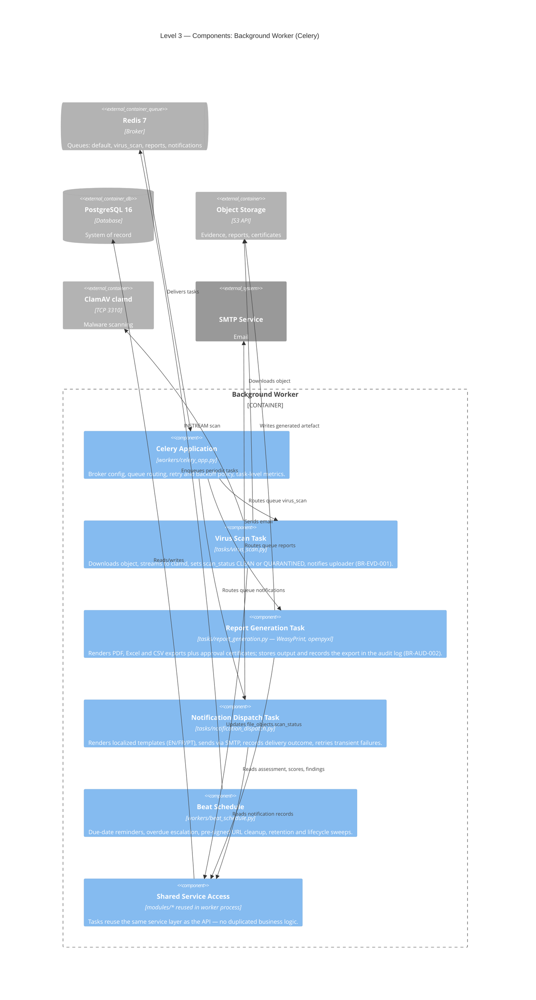

#### 25.4.3 Client Application Components

The React Native application (§9.2) is one codebase producing three artefacts. Components below are
feature slices, not screens; the screen inventory is Section 8.

```mermaid
C4Component
    title Level 3 — Components: Client Application (React Native)

    Container_Ext(proxy, "NGINX / API", "HTTPS", "REST /api/v1")
    Container_Ext(kc, "Keycloak", "OIDC", "Authorization Code + PKCE")
    Container_Ext(store, "Object Storage", "HTTPS", "Pre-signed PUT/GET")

    Container_Boundary(client, "Client Application") {
        Component(nav, "Navigation Shell", "React Navigation v7", "Public, Authenticated, Reviewer and Admin navigators; deep links; role-gated tabs.")
        Component(authf, "Auth Feature", "features/auth", "PKCE flow, token refresh scheduling, logout and revocation, session restore.")
        Component(perm, "Permission Layer", "permissions/", "Role-gate components and hooks. Advisory only — the API remains the authority.")
        Component(qform, "Questionnaire Renderer", "features/questionnaires, responses", "Renders response types from configuration, evaluates display_condition, React Hook Form + Zod validation.")
        Component(draft, "Draft and Sync Engine", "features/responses/store + sync", "Autosave debounce, version tracking, sync queue, 409 conflict resolver with keep-local / keep-server / merge.")
        Component(evdf, "Evidence Feature", "features/evidence", "Document picker, resumable upload to pre-signed URL, confirm call, scan-status polling.")
        Component(revf, "Review Feature", "features/reviews, adjudication", "Reviewer worklist, finding capture, evidence requests, adjudication and approval screens.")
        Component(resf, "Results and Analytics", "features/results, analytics — Victory Native", "Score gauges, band colouring with non-colour indicators, export requests.")
        Component(apic, "API Client", "api/client.ts — Axios", "Interceptors for Bearer token, refresh-on-401, If-Match headers, Idempotency-Key, error envelope decoding.")
        Component(query, "Server State Cache", "TanStack Query v5", "Caching, background refresh, optimistic updates, retry policy.")
        Component(local, "Local Storage", "expo-secure-store + expo-sqlite/SQLCipher", "Refresh token in keychain/keystore; encrypted questionnaire and draft cache; wiped on logout.")
        Component(i18n, "Localization", "i18next + expo-localization", "EN/FR/PT bundles, pluralization, RTL-ready token system.")
        Component(theme, "Design System", "components/ui + theme/tokens", "React Native Paper Material 3, WCAG 2.2 AA tokens, 44×44 pt targets.")
    }

    Rel(nav, perm, "Gates routes")
    Rel(nav, qform, "Hosts")
    Rel(nav, revf, "Hosts")
    Rel(nav, resf, "Hosts")
    Rel(authf, kc, "Authorization Code + PKCE", "HTTPS")
    Rel(authf, local, "Persists refresh token")
    Rel(qform, draft, "Emits answer changes")
    Rel(draft, local, "Writes encrypted drafts")
    Rel(draft, apic, "PATCH with If-Match version")
    Rel(evdf, apic, "Requests upload URL, confirms upload")
    Rel(evdf, store, "PUT file directly", "HTTPS")
    Rel(revf, apic, "Findings, requests, decisions")
    Rel(resf, apic, "Scores, exports")
    Rel(apic, query, "Feeds cache")
    Rel(apic, proxy, "HTTPS/JSON")
    Rel(qform, i18n, "Resolves labels")
    Rel(qform, theme, "Renders with")

    UpdateLayoutConfig($c4ShapeInRow="3", $c4BoundaryInRow="1")
```

---

### 25.5 Level 4 — Code

C4 Level 4 is drawn only where the design is non-obvious and getting it wrong is expensive. Two
components qualify: the scoring engine and the assessment state machine.

#### 25.5.1 Scoring Engine Class Structure

Implements BR-SCR-001..003 and the worked example in Section 24. All weights, compliance values,
the denominator factor and band thresholds are loaded from `scoring_rules` — none are constants in
code, which is what makes OD-001 through OD-003 configuration changes rather than code changes.

```mermaid
classDiagram
    class ScoringEngine {
        +compute(assessment_id: UUID, scope: ScoreScope) ScoreSet
        +recompute_all(assessment_id: UUID) ScoreSet
        +snapshot(assessment_id: UUID, trigger: TriggerEvent) ScoreSnapshot
        -_load_config(questionnaire_version_id: UUID) ScoringConfig
    }

    class ScoringConfig {
        +denominator_factor: Decimal
        +priority_weights: dict~Priority, Decimal~
        +compliance_values: dict~ComplianceCode, Decimal~
        +bands: list~ScoreBand~
        +na_policy: NaPolicy
        +unanswered_policy: UnansweredPolicy
        +band_for(percentage: Decimal) ScoreBand
    }

    class RequirementScorer {
        +score(response: Response, requirement: Requirement, cfg: ScoringConfig) RequirementScore
        -_is_excluded(response: Response) bool
        -_effective_value(response: Response) Decimal
    }

    class RequirementScore {
        +requirement_id: UUID
        +weight: Decimal
        +achieved: Decimal
        +max: Decimal
        +excluded: bool
        +unanswered: bool
        +override_applied: bool
    }

    class ScoreAggregator {
        +by_section(scores: list~RequirementScore~) list~Score~
        +by_requirement_type(scores: list~RequirementScore~) list~Score~
        +overall(scores: list~RequirementScore~) Score
    }

    class OverrideResolver {
        +apply(scores: list~RequirementScore~, findings: list~ReviewFinding~) list~RequirementScore~
        -_is_locked_by_adjudication(finding: ReviewFinding) bool
    }

    class Score {
        +scope: ScoreScope
        +scope_ref_id: UUID
        +achieved_score: Decimal
        +max_score: Decimal
        +percentage: Decimal
        +color_band: str
        +na_count: int
        +unanswered_count: int
    }

    class ScoreSnapshot {
        +assessment_id: UUID
        +trigger_event: TriggerEvent
        +snapshot: dict
        +snapshotted_at: datetime
    }

    class ScoreRepository {
        +upsert_scores(assessment_id: UUID, scores: list~Score~) None
        +insert_snapshot(snapshot: ScoreSnapshot) None
        +get_scores(assessment_id: UUID) list~Score~
    }

    class ScoreScope {
        <<enumeration>>
        OVERALL
        SECTION
        REQUIREMENT_TYPE
        PRIORITY
    }

    class TriggerEvent {
        <<enumeration>>
        SUBMITTED
        ADJUDICATED
        FINAL_DECISION
    }

    ScoringEngine --> ScoringConfig : loads
    ScoringEngine --> RequirementScorer : delegates per requirement
    ScoringEngine --> OverrideResolver : applies reviewer overrides
    ScoringEngine --> ScoreAggregator : rolls up
    ScoringEngine --> ScoreRepository : persists
    RequirementScorer --> RequirementScore : produces
    ScoreAggregator --> Score : produces
    ScoringEngine --> ScoreSnapshot : captures
    ScoringConfig --> ScoreScope
    ScoreSnapshot --> TriggerEvent
```

**Invariants the implementation must hold.**

- `RequirementScorer._is_excluded` returns true only for accepted N/A responses. An excluded
  requirement contributes to neither `achieved` nor `max` (BR-SCR-001).
- An unanswered requirement contributes `0` to `achieved` and its full weighted value to `max`
  (BR-SCR-002) and increments `unanswered_count`.
- `max = denominator_factor × priority_weight` per included requirement. With
  `denominator_factor = 3` the attainable maximum is 66.7%; with `2` it is 100% — this is OD-001,
  and until it is resolved the seeded value must be treated as provisional.
- `ScoreSnapshot` rows are insert-only. `ScoreRepository` exposes no update or delete for them
  (BR-SCR-003).
- `OverrideResolver` refuses to apply a finding whose review has been locked by an adjudication
  decision (BR-REV-004).

#### 25.5.2 Assessment State Machine

The full transition set from ASM-FR-003, encoded in `modules/assessments/transitions.py`. Every edge
is guarded by a role permission and writes an audit event.

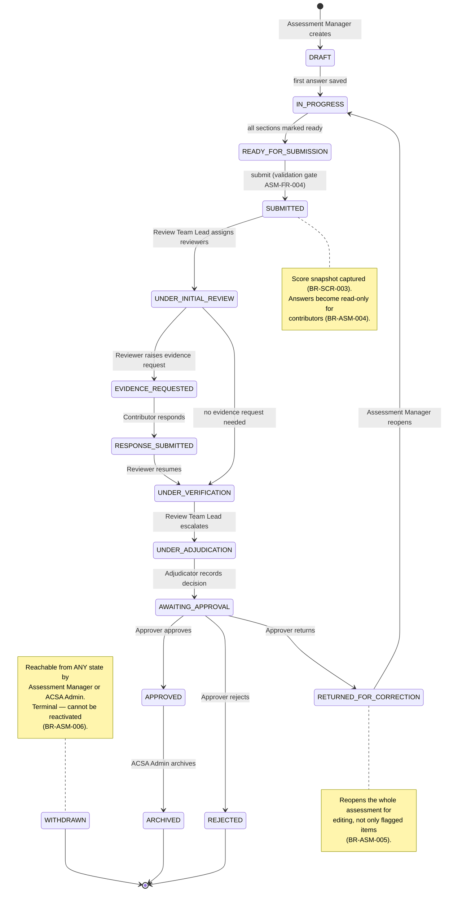

---

### 25.6 Dynamic Diagrams

Three scenarios where the collaboration between containers is the design.

#### 25.6.1 Evidence Upload and Malware Scanning

Implements §16.1 and §12.4. Note that the API never touches the file bytes.

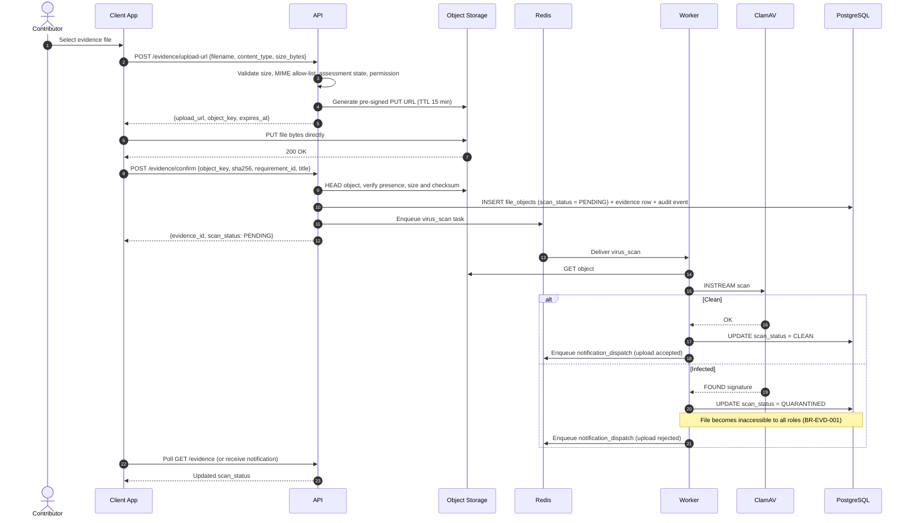

**Design consequence.** A requirement's submission gate (BR-ASM-003) requires at least one evidence
item in `CLEAN` status, so an assessment cannot be submitted while a scan is still `PENDING`. The
submission validation endpoint (`GET /assessments/{id}/validation`) must therefore report pending
scans as blocking items and not merely as warnings.

#### 25.6.2 Response Autosave with Optimistic Concurrency

Implements BR-RSP-002 and §12.3 — the mechanism that makes multi-contributor editing and offline
draft reconciliation safe.

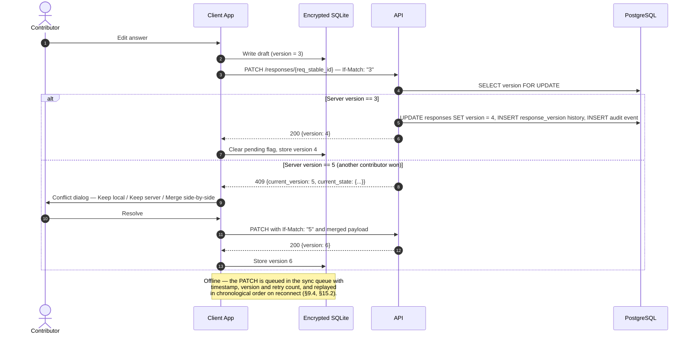

#### 25.6.3 Assessment Submission

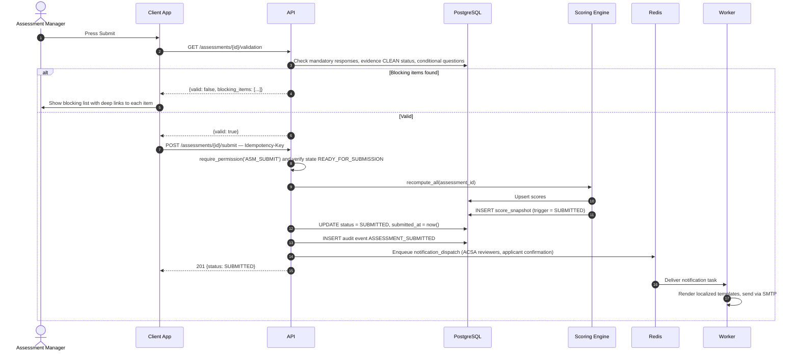

---

### 25.7 Level 5 — Deployment

#### 25.7.1 Production Deployment (Single Host, Docker Compose)

Mirrors `docker-compose.yml` in §17.1 exactly, including replica counts.

```mermaid
C4Deployment
    title Level 5 — Deployment: Production (Docker Compose, single host)

    Deployment_Node(ios, "iOS Device", "iOS 15+") {
        Container(appios, "ACSA Mobile App", "React Native via EAS Build", "TestFlight / App Store distribution")
    }
    Deployment_Node(android, "Android Device", "Android 8+") {
        Container(appdroid, "ACSA Mobile App", "React Native via EAS Build", "Play Store distribution")
    }
    Deployment_Node(desktop, "Workstation", "macOS / Windows / Linux") {
        Deployment_Node(browser, "Browser", "Chrome, Edge, Firefox, Safari") {
            Container(appweb, "ACSA Web App", "React Native Web bundle", "SPA served over HTTPS")
        }
    }

    Deployment_Node(host, "Application Host", "Linux VM — Docker Engine + Compose") {
        Deployment_Node(edge, "Edge Network", "docker network") {
            Container(nginx, "nginx", "nginx:alpine", "Ports 80/443. TLS from ./certs. Security headers. 10 MB body cap.")
        }
        Deployment_Node(appt, "Application Tier", "docker network") {
            Container(apic, "api ×2", "acsa-api:${APP_VERSION}", "uvicorn --workers 4. Alembic upgrade head on start.")
            Container(workc, "worker ×2", "acsa-api:${APP_VERSION}", "celery worker -Q default,virus_scan,reports,notifications")
            Container(beatc, "beat ×1", "acsa-api:${APP_VERSION}", "celery beat — must remain a single instance")
        }
        Deployment_Node(datat, "Data Tier", "docker network") {
            ContainerDb(pg, "db", "postgres:16", "Databases acsa_eval and acsa_keycloak. Volume postgres_data.")
            ContainerQueue(rd, "redis", "redis:7-alpine", "Broker, cache, idempotency keys. No persistent volume required.")
            Container(mn, "minio", "minio/minio", "Volume minio_data. Console on :9001.")
            Container(kcc, "keycloak", "quay.io/keycloak/keycloak:24", "Realm acsa. HTTPS via mounted certs.")
            Container(cl, "clamd", "clamav/clamav:stable", "Volume clamav_db. freshclam definitions.")
        }
        Deployment_Node(obst, "Observability Tier", "docker network") {
            Container(pr, "prometheus", "prom/prometheus", "Scrapes api and worker /metrics")
            Container(gf, "grafana", "grafana/grafana", "Volume grafana_data. Dashboards and alerts.")
        }
    }

    Deployment_Node(ext, "External Services", "Internet") {
        Container(smtpx, "SMTP Relay", "TLS", "Notification delivery")
        Container(sentryx, "Sentry", "SaaS or self-hosted", "Crash reporting")
        Container(bkp, "Backup Target", "Object store or NFS", "Nightly pg_dump + continuous WAL archive. RPO 1 h, RTO 4 h.")
    }

    Rel(appios, nginx, "HTTPS 443")
    Rel(appdroid, nginx, "HTTPS 443")
    Rel(appweb, nginx, "HTTPS 443")
    Rel(appios, kcc, "OIDC HTTPS")
    Rel(appweb, kcc, "OIDC HTTPS")
    Rel(appweb, mn, "Pre-signed PUT/GET HTTPS")
    Rel(nginx, apic, "HTTP 8000")
    Rel(apic, pg, "TCP 5432")
    Rel(apic, rd, "TCP 6379")
    Rel(apic, mn, "HTTP 9000")
    Rel(apic, kcc, "HTTP 8080")
    Rel(workc, rd, "TCP 6379")
    Rel(workc, pg, "TCP 5432")
    Rel(workc, cl, "TCP 3310")
    Rel(workc, mn, "HTTP 9000")
    Rel(workc, smtpx, "SMTP 587")
    Rel(beatc, rd, "TCP 6379")
    Rel(kcc, pg, "TCP 5432")
    Rel(pr, apic, "HTTP /metrics")
    Rel(pr, workc, "HTTP /metrics")
    Rel(gf, pr, "PromQL")
    Rel(apic, sentryx, "HTTPS")
    Rel(pg, bkp, "pg_dump + WAL archive")

    UpdateLayoutConfig($c4ShapeInRow="3", $c4BoundaryInRow="1")
```

#### 25.7.2 Environment Topology

| Environment | Topology | Object storage | Identity | Data |
|---|---|---|---|---|
| Development | Single developer machine, `docker compose up` | MinIO container | Keycloak container, seeded realm | Seeded questionnaire v1.0.0, synthetic organizations |
| CI | Ephemeral compose stack per pipeline run | MinIO container | Keycloak container | Migrated empty DB + fixtures; torn down after run |
| Staging | Same single-host compose as production | MinIO container | Keycloak container, staging realm | Anonymized copy of production |
| Production | Single host, replicas as drawn above; scale API/worker replicas as load requires | MinIO, or AWS S3 / Azure Blob / GCS via the same S3 API | Keycloak container, production realm, MFA enforced for review roles | System of record; nightly backup + WAL archiving |

#### 25.7.3 Scaling Path

The compose topology is deliberately sized for the stated load (500 concurrent users, §13.1). The
ordered path when that ceiling is approached:

1. Increase `api` replicas (stateless) and add upstreams to the NGINX `upstream api` block.
2. Increase `worker` replicas, splitting queues onto dedicated workers (`-Q reports` separately, as
   PDF generation is the long pole at < 30 s).
3. Introduce PgBouncer in front of PostgreSQL (§13.5) — a new container between `api` and `db`.
4. Add a PostgreSQL read replica and route the analytics module's reads to it (§13.5).
5. Only then consider moving to a container orchestrator. Nothing in this architecture depends on
   Compose specifically; every container is already stateless or volume-backed.

`beat` must never be scaled beyond one instance — duplicate schedulers produce duplicate reminder
emails and duplicate retention sweeps.

---

### 25.8 Build Sequence View — Mapping the Model onto Section 22

The same model, coloured by the implementation phase in which each element first becomes real. This
is the view to use in planning conversations: it shows what "Phase 1 complete" means in
architectural terms, and which dependencies force the ordering.

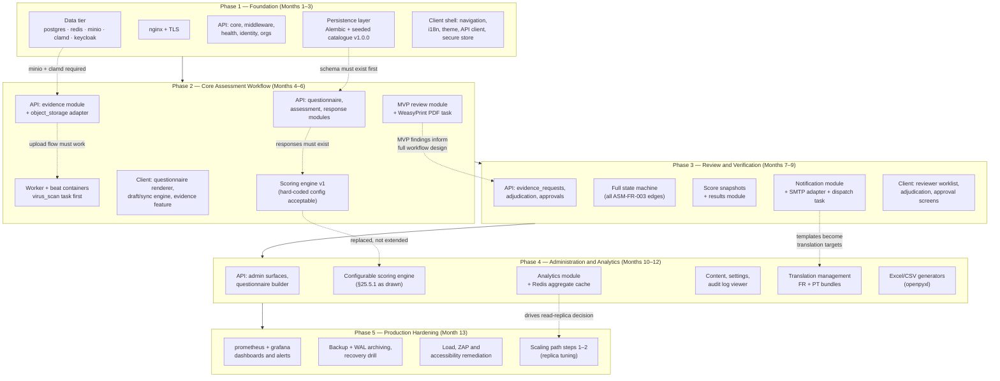

**Ordering constraints the diagram encodes.**

| Constraint | Reason |
|---|---|
| Data tier and Alembic pipeline precede every module | Nothing above the persistence layer is testable without a migrated schema and the seeded catalogue (§19.3 fixtures depend on all 208 requirements existing). |
| Object storage and ClamAV precede the evidence module | The upload flow in §25.6.1 has no meaningful partial implementation — a `PENDING` scan that never resolves blocks submission (BR-ASM-003). |
| The worker container arrives with the evidence module, not later | `virus_scan` is the first mandatory asynchronous task. Deferring the worker means building a synchronous scan path that must then be thrown away. |
| Scoring engine v1 in Phase 2, configurable engine in Phase 4 | Phase 2 needs *a* score to render results. The configurable engine (§25.5.1) is a replacement, so v1 should be written behind the same `ScoringEngine` interface and OD-001..003 must be resolved before Phase 4 seeds `scoring_rules`. |
| Full state machine in Phase 3, not Phase 2 | Phase 2's MVP review needs only `SUBMITTED → UNDER_INITIAL_REVIEW → RETURNED_FOR_CORRECTION`. Implement `transitions.py` as a table from the start so Phase 3 adds rows rather than rewriting control flow. |
| Notifications precede translation management | Email templates are the largest body of translatable content; building them monolingual and retrofitting i18n costs more than templating them from the outset, even while only EN bundles exist. |
| Observability tier in Phase 5 is a scheduling choice, not a technical one | `/metrics` should be exposed from Phase 1 (it costs almost nothing in `app/core`). Only the Prometheus and Grafana containers and dashboard authoring belong in Phase 5. |

**Architectural risk in this sequence.** Three Phase 4 items — the configurable scoring engine, the
questionnaire builder, and analytics — are the load-bearing claims of §1.5 ("all configuration is
database-driven"). They land last. If Phases 2 and 3 are built against hard-coded questionnaire
structure or hard-coded scoring constants, Phase 4 becomes a rewrite rather than a feature. The
mitigation is structural, not schedule-based: build Phase 2 against the *database-driven* reading
path from day one (requirements, response types and scoring rules read from tables even when only
one seeded version exists), and defer only the *authoring* UI to Phase 4.

---

### 25.9 Architectural Points Surfaced by the Model

Drawing the model exposed four items that the prose specification leaves implicit. They are
architectural decisions, not defects in the earlier sections, and should be confirmed alongside the
Section 20 open decisions.

| ID | Item | Why the diagram raises it | Suggested resolution |
|---|---|---|---|
| **AD-001** | The web bundle's hosting path is unspecified. §17.2 configures NGINX for `/api/` and `/health/` only, but the Container diagram needs an origin for the React Native Web SPA. | The SPA must be served from somewhere with the right CSP and cache headers. | Serve the static bundle from the same NGINX container via a `location /` block with immutable hashed assets and `index.html` fallback. Keeps the app same-origin with the API, which simplifies the HttpOnly refresh-token cookie. |
| **AD-002** | Object storage must accept browser `PUT` from the app origin. | The Context and Container diagrams show the client talking directly to storage. | Configure a CORS policy on the evidence bucket allowing `PUT`/`GET` from `CORS_ORIGINS`, restricted to the headers the pre-signed URL is signed with. Add to the §17.6 production checklist. |
| **AD-003** | Prometheus and Grafana are reachable on the host but not routed through NGINX. | The Deployment diagram shows them in their own tier with no ingress path. | Do not expose them publicly. Access via SSH tunnel or an authenticated internal-only NGINX server block. State this explicitly so it is not resolved ad hoc during deployment. |
| **AD-004** | `beat` single-instance is a correctness constraint, not a sizing choice. | The Deployment diagram makes the replica asymmetry visible. | Record it as an operational invariant with a startup guard (Redis lock) so a second scheduler refuses to run rather than silently duplicating work. |

---

### 25.10 Diagram-to-Specification Traceability

| Diagram | Primary source sections | Key requirement and rule IDs |
|---|---|---|
| §25.2 System Context | 1.1, 1.3, 1.5, 4.1 | — |
| §25.3 Container | 1.5, 9.1, 10.1, 13.5, 16.2, 17.1, 18.2 | — |
| §25.4.1 API Components | 10.1, 10.2, 12.2 | BR-AUD-001 |
| §25.4.2 Worker Components | 10.1, 14, 16.1, 18.2 | BR-EVD-001, BR-AUD-002 |
| §25.4.3 Client Components | 8, 9.1–9.4, 13.2, 13.4, 15.2 | — |
| §25.5.1 Scoring Engine | 6 (SCR module), 11.2, 24 | BR-SCR-001, BR-SCR-002, BR-SCR-003, BR-REV-004; OD-001, OD-002, OD-003 |
| §25.5.2 State Machine | 5, 6 (ASM-FR-003) | BR-ASM-001..006 |
| §25.6.1 Evidence Upload | 12.4, 16.1, 16.2 | BR-ASM-003, BR-EVD-001, BR-EVD-002, BR-EVD-003 |
| §25.6.2 Autosave | 9.4, 12.3, 15.2 | BR-RSP-001, BR-RSP-002, BR-RSP-003 |
| §25.6.3 Submission | 6 (ASM-FR-004), 12.6 | BR-ASM-003, BR-ASM-004, BR-SCR-003 |
| §25.7 Deployment | 13.3, 13.5, 17.1–17.6, 18.2 | — |

### 25.11 Maintaining This Model

- These diagrams are the architecture's single visual source of truth. A pull request that adds a
  container, a module under `app/modules/`, an external dependency, or a status transition must
  update the corresponding diagram in the same pull request.
- Diagrams are Mermaid source in this Markdown file — reviewable as a text diff. Do not replace them
  with exported images; images drift silently.
- Levels 1 and 2 should change rarely. Frequent Level 2 churn is a signal that the container
  boundaries were drawn wrong.
- Level 4 is deliberately incomplete by design. Add a code-level diagram only when a component's
  structure is genuinely non-obvious, and remove it when the code stops matching.

---
